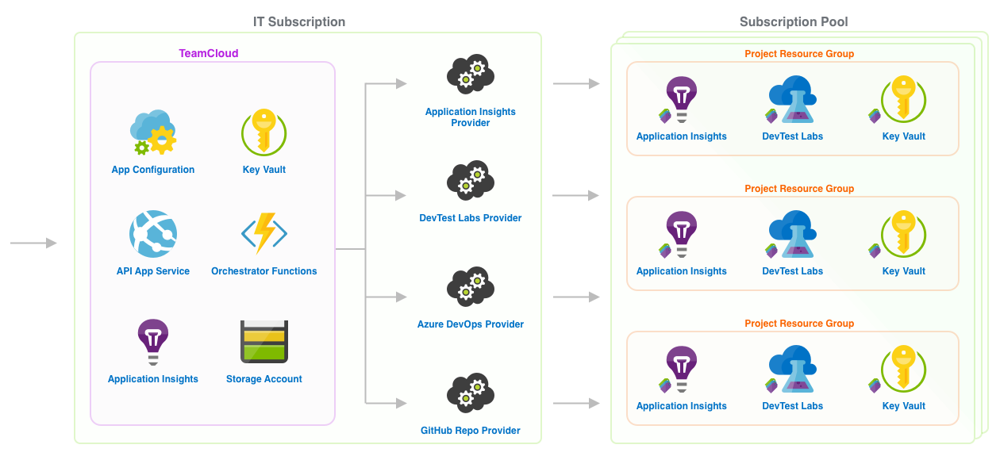

# TeamCloud

TeamCloud is a tool that enables enterprise IT organizations to provide application development teams "self-serve" access to secure compliant cloud development environments.


There are several components that make up the TeamCloud solution.

## TeamCloud CLI

The [TeamCloud CLI](docs/CLI.md) is an [extension](https://docs.microsoft.com/en-us/cli/azure/azure-cli-extensions-overview?view=azure-cli-latest) for the [Azure CLI](https://docs.microsoft.com/en-us/cli/azure/?view=azure-cli-latest).  It can be used by application development teams to create and manage Projects, and by TeamCloud admins to create new TeamCloud instances or manage existing instances.

### Install TeamCloud CLI

To install the Azure CLI TeamCloud extension, simply run the following command:

```sh
az extension add --source https://github.com/microsoft/TeamCloud/releases/latest/download/tc-0.5.3-py2.py3-none-any.whl -y
```

### Update TeamCloud CLI

To update Azure CLI TeamCloud extension to the latest version:

```sh
az tc update
```

or for the latest pre-release version:

```sh
az tc update --pre
```

## TeamCloud Instance

At the center of the tool is a TeamCloud instance (the source code in this repository). An enterprise deploys a single TeamCloud instance, along with one or more Providers, to an Azure subscription managed by its IT organization.

A TeamCloud instance is composed of two parts:

1. A user-facing [REST API](docs/API.md) that enables TeamCloud admins to manage the TeamCloud instance, and application development teams to create and manage Projects.
2. An internal [orchestration service](docs/Orchestrator.md) (sometimes referred to as "the orchestrator") that communicates with one or more [Providers](docs/Providers.md) responsible for creating and managing resources for a Project.

### TeamCloud Azure Resources

A TeamCloud instance is made up of the following Azure resources:

- [App Service][app-service]
- [App Configuration][app-configuration]
- [Cosmos DB][cosmos-db]
- [Function Apps][function-apps]
- [Storage Accounts][storage-account]
- [Key Vault][key-vault]
- [Event Grid][event-grid]
- [Application Insights][application-insights]



These resources are deployed using the [CLI](docs/CLI.md). After installing the CLI use `az tc deploy -h` deployment instructions.

## TeamCloud Website

Although the TeamCloud CLI exposes all functionality provided by TeamCloud, you can also deploy a client website to interact with your instance.


## Projects

A TeamCloud instance and its registered Providers define a templates (Project Types) for a policy-compliant, secure, cloud development environment, which software development teams can create on-demand.  In the context of TeamCloud, these cloud development environments are called Projects.

## Providers

A Provider is responsible for managing one or more resources for a Project.  For example, an organization may implement an "Azure Key Vault Provider" responsible for creating a new Key Vault instance for each Project.  Another example would be a "GitHub repo provider" that creates an associated source code repository for each Project.

Providers are registered with a TeamCloud instance and invoked by the Orchestrator when a Project is created or changed.  Any service that implements required REST endpoints can be registered as a Provider using the [CLI](docs/CLI.md).

# About


**This project is in active development and will change.**  As the tool becomes ready for use, it will be [versioned](https://semver.org/) and released.

We will do our best to conduct all development openly by [documenting](https://github.com/microsoft/TeamCloud/tree/main/docs) features and requirements, and managing the project using [issues](https://github.com/microsoft/TeamCloud/issues), [milestones](https://github.com/microsoft/TeamCloud/milestones), and [projects](https://github.com/microsoft/TeamCloud/projects).

## Contributing

This project welcomes contributions and suggestions.  Most contributions require you to agree to a
Contributor License Agreement (CLA) declaring that you have the right to, and actually do, grant us
the rights to use your contribution. For details, visit https://cla.opensource.microsoft.com.

When you submit a pull request, a CLA bot will automatically determine whether you need to provide
a CLA and decorate the PR appropriately (e.g., status check, comment). Simply follow the instructions
provided by the bot. You will only need to do this once across all repos using our CLA.

This project has adopted the [Microsoft Open Source Code of Conduct](https://opensource.microsoft.com/codeofconduct/).
For more information see the [Code of Conduct FAQ](https://opensource.microsoft.com/codeofconduct/faq/) or
contact [opencode@microsoft.com](mailto:opencode@microsoft.com) with any additional questions or comments.

[app-service]:https://azure.microsoft.com/en-us/services/app-service/
[app-configuration]:https://azure.microsoft.com/en-us/services/app-configuration/
[function-apps]:https://azure.microsoft.com/en-us/services/functions/
[storage-account]:https://azure.microsoft.com/en-us/services/storage/
[key-vault]:https://azure.microsoft.com/en-us/services/key-vault/
[event-grid]:https://azure.microsoft.com/en-us/services/event-grid/
[application-insights]:https://azure.microsoft.com/en-us/services/monitor/
[cosmos-db]:https://azure.microsoft.com/en-us/services/cosmos-db/
