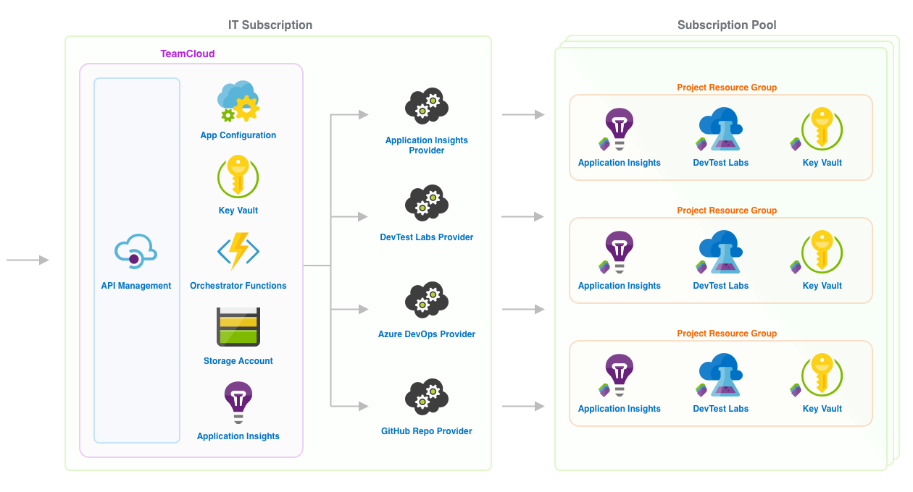

# TeamCloud

TeamCloud is a tool that enables enterprise IT organizations to provide application development teams "self-serve" access to secure compliant cloud development environments.

## Concepts

There are several components that make up the TeamCloud solution:

### TeamCloud Instance

At the center of the tool is a TeamCloud instance (the source code in this repository).  An enterprise deploys a single TeamCloud instance, along with one or more Providers, to an Azure subscription managed by its IT organization.

A TeamCloud instance is composed of two parts:

1. A user-facing [REST API](docs/API.md) that enables TeamCloud admins to manage the TeamCloud instance, and application development teams to create and manage Projects.
2. An internal [orchestration service](docs/architecture/Orchestrator.md) (sometimes referred to as "the orchestrator") that communicates with one or more [Providers](docs/Providers.md) responsible for creating and managing resources for a Project.

Together, the TeamCloud instance and its registered Providers define a template for a policy-compliant, secure, cloud development environment, which software development teams can create on-demand.

#### TeamCloud Azure Resources

A TeamCloud instance is made up of the following Azure resources:

- [App Configuration][app-configuration]
- [Function Apps][function-apps]
- [Storage Account][storage-account]
- [Key Vault][key-vault]
- [Event Grid][event-grid]
- [Application Insights][application-insights]

These resources are deployed by an ARM template in this repo.  For deployment instructions, see the [deployment documentation](docs/Deploy.md).

### Projects

A TeamCloud instance and its registered Providers define a template for a policy-compliant, secure, cloud development environment, which software development teams can create on-demand.  In the context of TeamCloud, these cloud development environments are called Projects.

### Providers

A Provider is responsible for managing one or more resources for a Project.  For example, an organization may implement an "Azure Key Vault Provider" responsible for creating a new Key Vault instance for each Project.  Another example would be a "GitHub repo provider" that creates an associated source code repository for each Project.

Providers are registered with a TeamCloud instance and invoked by the Orchestrator when a Project is created or changed.  Any service that implements [required REST endpoints](docs/Providers.md) can be [registered as a Provider](docs/TeamCloudYaml.md).

## Use

There are a few steps steps required to get a TeamCloud instance configured and deployed:

1. [Deploy TeamCloud to Azure](#deploy-teamcloud-to-azure)
2. [Deploy Providers](#deploy-roviders)
3. [Import TeamCloud Yaml Configuration](#teamcloud-yaml)

### Deploy TeamCloud to Azure

[![Deploy to Azure][azure-deploy-button]][azure-deploy]

Deploying the Azure resources is as simple as clicking the link above and filling in a few fields.  Below is a brief explanation/guidance for filling in each field, please [file an issue](issues/new?labels=docs) if you have questions or require additional help.

- **`Subscription`** Select which Azure subscription you want to use.  It's okay if you only have one choice, or you don't see this option at all.
- **`Resource group`** Unless you have an existing Resource group that you know you want to use, select __Create new__ and provide a name for the new group.  _(a resource group is essentially a parent folder to deploy the resources that make up the TeamCloud instance).
- **`Location`** Select the region to deploy the new resources. You want to choose a region that best describes your location (or your users location).
- **`Function App Name`** Provide a name for your app.  This can be the same name as your Resource group, and will be used as the subdomain for your service endpoint.  For example, if you used `superawesome`, your TeamCloud API would live at `superawesome.azurewebsites.net/api`.
- **Agree & Purchase:** Read and agree to the _TERMS AND CONDITIONS_, then click _Purchase_.

## About

**This project is in active development and will change.**  As the tool becomes ready for use, it will be [versioned](https://semver.org/) and released.

We will do our best to conduct all development openly by [documenting](https://github.com/microsoft/TeamCloud/tree/master/docs) features and requirements, and managing the project using [issues](https://github.com/microsoft/TeamCloud/issues), [milestones](https://github.com/microsoft/TeamCloud/milestones), and [projects](https://github.com/microsoft/TeamCloud/projects).

## Contributing

This project welcomes contributions and suggestions.  Most contributions require you to agree to a
Contributor License Agreement (CLA) declaring that you have the right to, and actually do, grant us
the rights to use your contribution. For details, visit https://cla.opensource.microsoft.com.

When you submit a pull request, a CLA bot will automatically determine whether you need to provide
a CLA and decorate the PR appropriately (e.g., status check, comment). Simply follow the instructions
provided by the bot. You will only need to do this once across all repos using our CLA.

This project has adopted the [Microsoft Open Source Code of Conduct](https://opensource.microsoft.com/codeofconduct/).
For more information see the [Code of Conduct FAQ](https://opensource.microsoft.com/codeofconduct/faq/) or
contact [opencode@microsoft.com](mailto:opencode@microsoft.com) with any additional questions or comments.

[app-configuration]:https://azure.microsoft.com/en-us/services/app-configuration/
[function-apps]:https://azure.microsoft.com/en-us/services/functions/
[storage-account]:https://azure.microsoft.com/en-us/services/storage/
[key-vault]:https://azure.microsoft.com/en-us/services/key-vault/
[event-grid]:https://azure.microsoft.com/en-us/services/event-grid/
[application-insights]:https://azure.microsoft.com/en-us/services/monitor/

[azure-deploy]:https://portal.azure.com/#create/Microsoft.Template/uri/https%3A%2F%2Fraw.githubusercontent.com%2Fmicrosoft%2FTeamCloud%2Fmaster%2Fazuredeploy.json
[azure-deploy-button]:https://azuredeploy.net/deploybutton.svg